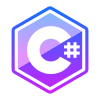

# ¡Hola que tal! Soy Yinner Chilito 👋

Soy un **analista y desarrollador** de sistemas de información, con experiencia en el ciclo de vida de **desarrollo de software**, como lo es la recolección de requisitos, diseño, programación **(especialidad en Backend)**, pruebas y despliegue.

Me encanta crear aplicaciones que ayuden a las personas a realizar sus tareas de forma rápida y efectiva.

## 💻 Tecnologías que manejo

---

### Lenguajes y frameworks

 

### Bases de datos

#### Relacional

#### No relacional

### 🌱 Actualmente estoy aprendiendo

### 📫 Cómo contactar conmigo

---

</a>

